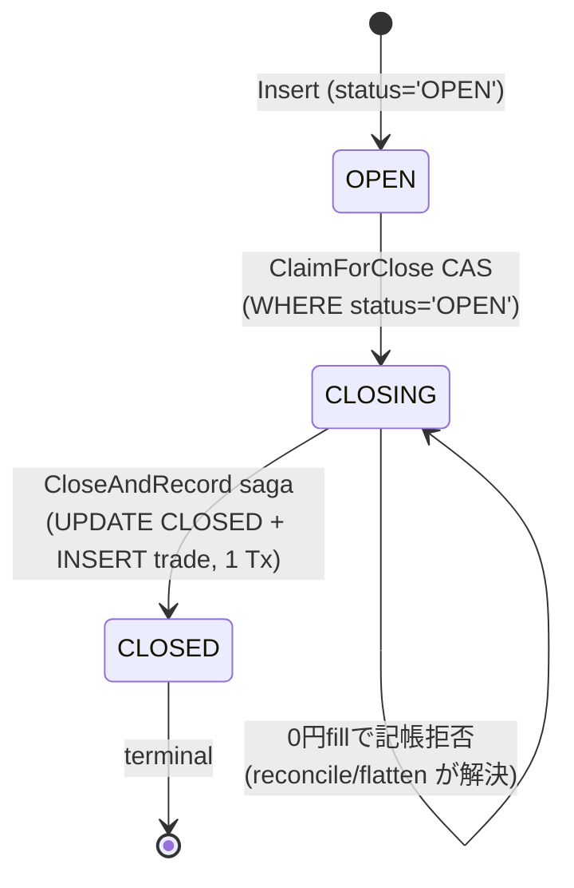

# Position 状態機械 (Position State Machine)

## 役割
Position の lifecycle — `OPEN → CLOSING → CLOSED` — と、その遷移を「二重 close できない」「0 円 trade を記帳しない」形で守る CAS / close saga / reconcile の契約を定める。

---

## やること (do)

- Position の status を 3 値 `OPEN` / `CLOSING` / `CLOSED` で表し、`CLOSING` を「exit 判断と fill 記帳のあいだの in-flight 状態」として扱う ([position.go](../../backend/internal/domain/position/position.go)。含み損益の helper は `UnrealizedJPY`(円/株)だけ)。同じパッケージの `Per1MNotional`([notional.go](../../backend/internal/domain/position/notional.go)・損益の ¥1M 正規化)と `CarryCalc`(carry.go)は金額の計算で、状態遷移には関与しない。
- close は必ず **`ClaimForClose` CAS** で `OPEN → CLOSING` を取ってから始める。claim 成功者だけが broker close + 記帳に進む ([exit_executor.go](../../backend/internal/usecase/command/exit_executor.go))。
- 記帳は **`CloseAndRecord` saga**(positions を `CLOSED` に更新 + trades を INSERT を 1 Tx)で原子的に行う ([pg/closer.go](../../backend/internal/adapter/repository/pg/closer.go))。
- close 価格を正直に評価できないときは **0 円 trade を記帳せず `CLOSING` のまま残す**。後続の reconcile / forced-flatten に解決を委ねる ([exit_executor.go](../../backend/internal/usecase/command/exit_executor.go))。
- reconcile で broker 帳簿と DB を突き合わせ、broker にだけある裸ポジは **external として adopt**(working な close 側注文が無ければ即 trip)、DB が `OPEN` なのに broker に無いポジは **grace 内 DEFER → 超過で観測可能価格による cold-close 記帳 → 価格が取れないまま hard window 超過で emergency trip** する ([reconcile.go](../../backend/internal/usecase/command/reconcile.go))。
- exit trigger を OnTick(time/path 系)と broker 側 OCO(価格系)に分け、broker OCO を主たる守りに据える ([manage_open_positions.go](../../backend/internal/usecase/command/manage_open_positions.go))。

---

## やらないこと (don't)

- CAS を経ずに `OPEN` のポジを直接 `CLOSED` にしない。`OPEN → CLOSED` の skip 遷移は存在しない(必ず `CLOSING` を経由)。
- `CLOSING` / `CLOSED` のポジを再 claim しない。`ClaimForClose` は `ok=false`(benign skip)を返すだけで、二重 close を発生させない ([inmemory.go](../../backend/internal/adapter/repository/inmemory.go))。
- close 価格が取れないときに 0 円や推測値で trade を記帳しない(PnL を捏造しない = **0 円・推測値で記帳しない**。**観測できた価格での cold-close 記帳は行う**)。
- reconcile で drift を見つけても PnL を**推測**で埋めない。観測可能な価格で cold-close 記帳できないときは DEFER か trip のどちらかで、勝手に CLOSED にしない。
- external adoption(`source='external_broker'`)を bot の exit 対象に含めない。表示・担保カウント専用。**例外: `ExecKind==margin_oneday` の external は 14:50 引け前フラット化の対象**([manage_open_positions.go](../../backend/internal/usecase/command/manage_open_positions.go), [force_flatten.go](../../backend/internal/usecase/command/force_flatten.go), [CLAUDE.md](../../CLAUDE.md))。
- bot 内 OnTick 監視だけを TP/SL の守りにしない。TP/SL は broker 側 OCO/逆指値が必須([CLAUDE.md](../../CLAUDE.md) トレード不変条件)。

---

## 状態と遷移

### status 値(SSOT = migration)
`positions.status` の取りうる値は migration の CHECK 制約で固定:

```sql
status TEXT NOT NULL CHECK (status IN ('OPEN','CLOSING','CLOSED'))
```

([0001_init.up.sql](../../migrations/0001_init.up.sql))。

| status | 意味 | 何が真か |
|---|---|---|
| `OPEN` | 約定済 / at-risk | broker に建玉があり、TP/SL leg(OCO)が張られている。OnTick の exit 評価対象 |
| `CLOSING` | close saga in-flight | `ClaimForClose` の CAS で claim 済み。新規 claim 不可。fill 記帳前 |
| `CLOSED` | terminal | trades 行が存在し PnL 確定。`closed_at` セット済。再 open しない |



### CAS — `ClaimForClose`(二重 close 防止)
`OPEN` 行だけが `CLOSING` に遷移できる。pg 実装はこの 1 文:

```sql
UPDATE positions SET status='CLOSING' WHERE id=$1 AND status='OPEN'
```

`RowsAffected()==1` のときだけ `ok=true`。既に `CLOSING` / `CLOSED` なら 0 行更新 → `ok=false`(benign skip)で、claim を取れなかった呼び出し側は close を進めない ([pg/position_repo.go](../../backend/internal/adapter/repository/pg/position_repo.go))。in-memory 実装も同じ意味で `Status != StatusOpen` を弾く ([inmemory.go](../../backend/internal/adapter/repository/inmemory.go))。

### saga — `CloseAndRecord`(原子的記帳)
claim 済(`CLOSING`)のポジだけを `CLOSED` にし、同じ Tx で trades を INSERT する:

```sql
-- 1 Tx 内
UPDATE positions SET status='CLOSED', closed_at=$2 WHERE id=$1 AND status='CLOSING'
INSERT INTO trades (...) VALUES (...)
```

`UPDATE` が 1 行に当たらなければ(= `CLOSING` でない)benign skip し、trade を INSERT しない ([pg/closer.go](../../backend/internal/adapter/repository/pg/closer.go))。in-memory 版も `Status != StatusClosing` を弾いてから原子的に flip + Insert する ([close_saga.go](../../backend/internal/adapter/repository/close_saga.go))。

### 0 円 trade の記帳拒否
`closeOne` は close 価格を `FilledPrice → observedPrice → 新規 quote の Mid` の順で解決する。それでも `closePrice <= 0` のときは **trade を記帳せず `CLOSING` のまま return する**。「正直に評価できない close を 0 円で記帳しない」ための fail-safe で、解決は reconcile / forced-flatten に委ねる ([exit_executor.go](../../backend/internal/usecase/command/exit_executor.go))。

---

## exit trigger 一覧

| trigger | reason 値 | 守りの主体 | 出所 |
|---|---|---|---|
| take-profit | `take_profit` | broker OCO(主) + OnTick(backup) | [manage_open_positions.go](../../backend/internal/usecase/command/manage_open_positions.go) / [exit.go](../../backend/internal/domain/position/exit.go) |
| stop-loss | `stop_loss` | broker 逆指値(主) + OnTick(backup) | 同上 |
| ratchet trailing TP | `ratchet_takeprofit`(gross ≥ 0)/ `ratchet_giveback_loss`(gross < 0・0013) | OnTick(`EvaluateExit`) → ラベルは `port.RatchetCloseReason` が**約定値の gross の符号**で決める | [exit.go](../../backend/internal/domain/position/exit.go) |
| MaxHold | `max_hold` | OnTick(soft 期限 `MaxHoldUntil` 経過)。多日建玉の期限は **N 営業日目の 14:50**(`session.MaxHoldDeadline` が entry 時に分へ直して凍結)。損益に依らずこの時刻で決済 | 同上 / [position.go](../../backend/internal/domain/position/position.go) |
| MaxHold extension | (exit しない — 損益が建値近傍なら `max_hold` を hard 期限まで先送り) | OnTick(`EvaluateExit`。`ExtensionMaxMinutes` / `ExtensionUnrealizedJPY`) | [exit.go](../../backend/internal/domain/position/exit.go) |
| MaxHold 手動延長(人間) | (exit しない — `max_hold_minutes` を加算して soft 期限を後ろへ) | `POST …/positions/extend`(`ExtendMaxHold`・config 凍結の唯一の例外・emergency 中は reject)。1 回あたりの上限は `position.MaxExtendMinutes`(intraday 720 分 / multiday 30 日)。延長先の候補は各営業日の引け前(`ListExtendOptions`)。画面にはボタンを置かない(API のみ。ダッシュボードにボタンは無い)。**broker 側の守りには触らない** | [max_extend.go](../../backend/internal/domain/position/max_extend.go) / [extend_maxhold.go](../../backend/internal/usecase/command/extend_maxhold.go) |
| early-exit | `early_exit` | OnTick(soft 期限前の window 内で目標益到達) | 同上 |
| `harvest_expiry` | 旧 enum 値(0018)。これを出すコード経路は無い | — | — |
| 引け前フラット化(14:50) | `forced_flat` | ForceFlatten(intraday のみ MARKET 強制返済) | [force_flatten.go](../../backend/internal/usecase/command/force_flatten.go), [session.go](../../backend/internal/domain/session/session.go) |
| 維持率割れ | (trip → entry halt) | OnTick の維持率 breaker → emergency trip | [manage_open_positions.go](../../backend/internal/usecase/command/manage_open_positions.go) |

`EvaluateExit` は [domain/position/exit.go](../../backend/internal/domain/position/exit.go) の**純関数**(live の OnTick と backtest エンジンが共有)。評価優先順位: **ratchet → take-profit → stop-loss → max-hold(extension 付き)→ early-exit window**(table-test 済)。TP/SL は建玉時に凍結した**絶対価格(円/株)**との比較で、tick 換算しない。

**トレールの床(migration 0013)**: ratchet の決済線は
`floor = max(RatchetArmJPY, peak − RatchetGivebackJPY)` で、`unreal <= floor` で決済する
(触れたら出る = 旧規則 `(peak−unreal) >= giveback` と同じ比較の向き)。**armed になったら
建値割れで出ない。** giveback(1.5×ATR)が arm(1.0×ATR)より大きい旧規則では、peak が
1.0〜1.5×ATR の帯で armed になった玉は**構造的に必ず損で出て**いた(名前と実装の矛盾で、
1 本も約定を見なくても指摘できる欠陥)。peak ≥ arm+giveback では旧規則と完全に同じ。
床が効くのは **`ratchet_floor_at_arm = true` の建玉だけ** — 凍結値から実行時に計算される
ので、フラグが無いと既存の建玉にもその場で効き、測っている対象が途中で入れ替わる。`ProtectiveExit`(画面と broker に出す守りの値段)も
**同じ `ratchetFloor` を通す** — 片方だけ旧式だと表示と実際の決済線が静かにずれる。
**板の SL への反映(live)**: `TrailFloorStopPrice` が同じ `ratchetFloor` を価格(呼値に丸める)に
直し、`command.RaiseTrailStops` が寄り前の窓で、線が立っている建玉の板の SL をそこまで引き上げる
(上げるだけ・前日終値が線以下なら置かない・取消 → 再発注と台帳の SL の更新は `RepriceProtectiveOrder`)。
bot が場中に居なくても、線を割ったら broker の逆指値が売る。場中に上がった線は翌朝まで板に載らない。
板の逆指値で決まった往復は `stop_loss`(gross は正)として記帳される。

決済しないティックでは **MFE/MAE の記録**を返す(`ExcursionChanged` / `NewPeak` / `NewTrough` / `NewArmed` → `UpdateExcursion` で永続化)。**ratchet を持たない建玉でも更新する**(0010〜): peak を読むのは ratchet の giveback 線だけで、trough はどの決済規則も読まない — 「トレールだったらどこで決済されていたか」「SL がもう少し広ければ助かったか」を**事後に**計算するための記録。**出口の規則そのものは何も変わっていない。**

引け前フラット化は `IsNearClose(now)`(= `ForceFlatAt` 14:50 以降)で発火し、`HoldingMode==HoldingIntraday` のポジを `forced_flat` で MARKET 返済する(external は対象外、ただし **`ExecKind==margin_oneday` の external は対象** — 持ち越しペナルティが無条件のため)。返済 reject は最優先 safety event として emergency を `forced_liquidation_failed` で trip する ([force_flatten.go](../../backend/internal/usecase/command/force_flatten.go))。

維持率 breaker は `maintenanceRatio > 0` のとき `am.MarginRatio < maintenanceRatio` を検知して emergency を `margin_maintenance_breach` で trip する(close は OnTick の他 trigger 経由) ([manage_open_positions.go](../../backend/internal/usecase/command/manage_open_positions.go))。

---

## reconcile(broker 帳簿との突き合わせ)

`Reconcile.Run(ctx, symbol)` は 1 pass で次の **4 分岐**を判定し、`ReconcileReport{Adopted, Deferred, Tripped, ColdClosed}` を返す ([reconcile.go](../../backend/internal/usecase/command/reconcile.go)):

- **① adopt(external 採用)**: broker にあって DB に無い裸ポジ。ただし entry saga in-flight(`pending.IsPending`)は誤採用しない。`AdoptExternal` で `source='external_broker'`・`holding_mode` は **exec_kind 追従**(一日信用 → `intraday`、それ以外 → `multiday`)で記録 ([pg/position_repo.go](../../backend/internal/adapter/repository/pg/position_repo.go), [inmemory.go](../../backend/internal/adapter/repository/inmemory.go))。**adopt した裸ポジに working な close 側注文が無ければ**(broker 側の守りが無い孤児 — 例: fill と OCO 設置の間で bot がクラッシュ)`external_adopt_unprotected` で**即 emergency trip**。
- **② stale(DB `OPEN` だが broker に無い)**: 初検知から `defaultStaleGracePeriod = 90s` までは DEFER(broker が追いついていないだけの可能性)。grace 超過で記帳。**まず `GetExecutions` の実約定を探す** — 決済側の約定が建玉数量と一致すれば**その約定値・実手数料**で締め、理由は凍結した守りのどちら側で約定したかで `stop_loss` / `take_profit`、どちらでもなければ `broker_close`(`fee_estimated=false`)。**broker 側 OCO の約定こそが live の通常の出口**なので、ここを時価で埋めると出口の種類も値段も台帳から失われる。実約定が引けないときだけ**観測可能な現在価格による cold-close 記帳**(`close_reason='reconcile_cold_close'` = **値段すら観測できず近似した**というラベルで、出口の種類ではない)。価格が取れず記帳できないまま `defaultStaleHardTripPeriod = 10m` を超えたら `reconcile_stale_position_unresolved:<id>` で emergency trip。
- **③ 座礁 CLOSING(DB `CLOSING` だが broker がまだ持っている)**: close が reject / 喪失された疑い。grace 内は待ち(元の close がまだ fill しうる)、grace 超過で close 側の working 注文が無ければ **MARKET close を再発注**して記帳、hard window(10 分)超過で `close_stuck_unresolved` で trip。
- **④ 消えた external**: external 採用ポジが broker から消えた(持ち主が閉じた)。
  `MarkClosed` だけでなく **trade 行を書く**(`close_reason='external_close'`・migration 0012)。戦略成績ではないが**口座には実額として
  効く**ので台帳から消さない — エッジ判定側で `close_reason` で外す。
  ただし `port.CountsTowardEntryGates` は **external_close だけ false**(人間が同じ銘柄で
  勝って決済したのを bot の連敗リセットに使わせない)。
  **観測可能な価格が取れなければ trade は書かず建玉だけ閉じる**(PnL 捏造禁止)。
  いずれにせよ `OPEN` のまま残さない — 残すとナンピンゲートが当該銘柄を永久ブロックする。

reconcile は **PnL を捏造しない** = **0 円・推測値で trade を記帳しない**(観測できた価格での cold-close 記帳は行う)。正直に評価できない drift は DEFER か trip のいずれかで、勝手に CLOSED 化しない ([reconcile.go](../../backend/internal/usecase/command/reconcile.go))。

---

## 命名・配置

- domain: `position.Status`(`StatusOpen` / `StatusClosing` / `StatusClosed`)— [position.go](../../backend/internal/domain/position/position.go)。
- CAS / saga port: `PositionRepository.ClaimForClose`, `PositionCloser.CloseAndRecord` — [port/repository.go](../../backend/internal/port/repository.go)。
- usecase(状態変更系は `usecase/command`): exit engine = `ManageOpenPositions`、共有 close 経路 = `closeExecutor.closeOne`、引け前 = `ForceFlatten`、突き合わせ = `Reconcile`。
- adapter 実装: pg(`pg/position_repo.go`, `pg/closer.go`)と in-memory(`inmemory.go`, `close_saga.go`)が同一 port を満たす。
- DB スキーマ SSOT: [migrations/0001_init.up.sql](../../migrations/0001_init.up.sql)(`positions.status` CHECK・`trades.close_reason` CHECK)。

---

## 株式分割の言い直し(状態遷移ではない)

権利落ち日の `ApplySplit` は **OPEN の建玉の中身を書き直すだけ**で状態は動かさない(OPEN → OPEN)。CAS 条件は
`status='OPEN' AND split_adjusted_on IS DISTINCT FROM <その日>`。CLOSING / CLOSED は触らない(決済中の数量を変えない)。
live で分割を確かめられない建玉は、その日は `EvaluateExit` に回さない(OPEN のまま・新規は `split_unconfirmed` で止まる)。

## テスト方法

- usecase の close / exit / reconcile 経路: [command_test.go](../../backend/internal/usecase/command/command_test.go)(`go test ./backend/internal/usecase/command/...`)。
- in-memory repo の CAS / saga 不変条件: [repository_test.go](../../backend/internal/adapter/repository/repository_test.go)。
- pg adapter の CAS / saga 原子性: [pg/integration_test.go](../../backend/internal/adapter/repository/pg/integration_test.go)。integration は `make test-integration` 経由のみ(`go test -tags integration` を生で打たない。[CLAUDE.md](../../CLAUDE.md))。
- マージゲートは `make check-backend`(`go test -race ./...` + `go vet ./...` + `go build ./...`)。
- 守る不変条件(test 化):
  - I1: `OPEN` 以外からは claim できない(`ClaimForClose` が `ok=false`)。
  - I2: claim 済(`CLOSING`)以外は記帳しない(`CloseAndRecord` が `ok=false`)。
  - I3: close 価格 `<= 0` なら trade を記帳せず `CLOSING` のまま残る。
  - I4: stale DB は grace 内 DEFER、grace 超過で観測可能価格の cold-close 記帳、記帳できないまま hard window 超過で emergency trip。
  - I5: external adoption は exit / forced-flatten の対象外(例外: `ExecKind==margin_oneday` の external は 14:50 フラット化の対象)。

---

## アンチパターン

- `MarkClosed` を CAS / saga の代わりに使い、trades INSERT を別 Tx に分けて記帳する(close と記帳が原子的でなくなり、CLOSED なのに trade が無い穴が空く)。
- claim 失敗(`ok=false`)を error 扱いしてリトライ嵐にする。benign skip として静かに次へ進むのが正。
- close 価格が取れないとき observedPrice=0 のまま記帳する(0 円 PnL の捏造)。
- reconcile の stale を即 trip する / grace を無視する(broker の遅延を異常と誤検知して無駄に emergency に入る。正: grace 内 DEFER → cold-close 記帳 → hard window で trip)。
- external_broker ポジを bot が勝手に返済・MaxHold 評価する。

---

## 未定の点

- **`UNKNOWN` status**: domain には `position.StatusUnknown = "UNKNOWN"` が定義されている([position.go](../../backend/internal/domain/position/position.go))が、`positions.status` の CHECK 制約は `('OPEN','CLOSING','CLOSED')` のみで `UNKNOWN` を許さない([0001_init.up.sql](../../migrations/0001_init.up.sql))。現状コードでは status を `UNKNOWN` に遷移させる経路は見当たらず(stale は emergency trip で表現)、`UNKNOWN` を DB 永続化する設計か domain 内限定の番兵かは未定。
- **state ledger(append-only な遷移履歴テーブル)**: migration には遷移履歴専用テーブルが存在せず、status は `positions` 行のキャッシュのみ。遷移の append-only ledger を別途持つかは未定。

---

## 関連 docs

- [DATA_MODEL.md](DATA_MODEL.md) — positions / trades を含む schema 概要
- [layers/safety.md](../architecture/layers/safety.md) — emergency_stop と trip 経路の位置づけ
- [layers/usecase.md](../architecture/layers/usecase.md) — command(状態変更・Tx)の規約
- [layers/adapter.md](../architecture/layers/adapter.md) — pg / in-memory repo の責務
- [PR_CHECKLIST.md](../architecture/PR_CHECKLIST.md) — 不変条件チェック
- [CLAUDE.md](../../CLAUDE.md) — トレード不変条件(TP/SL broker 側必須・引け前フラット化・維持率 breaker)
